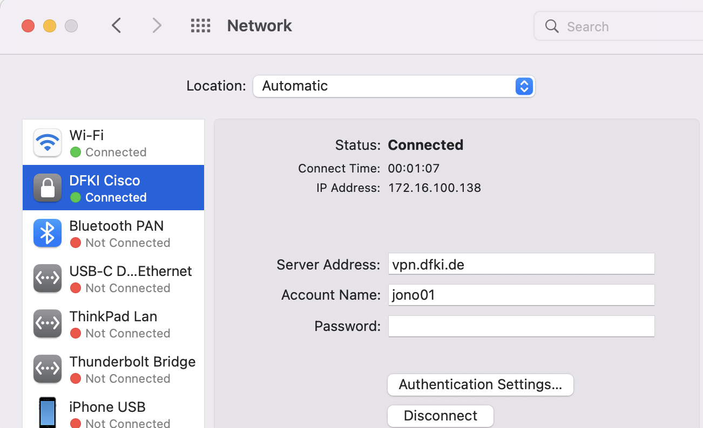
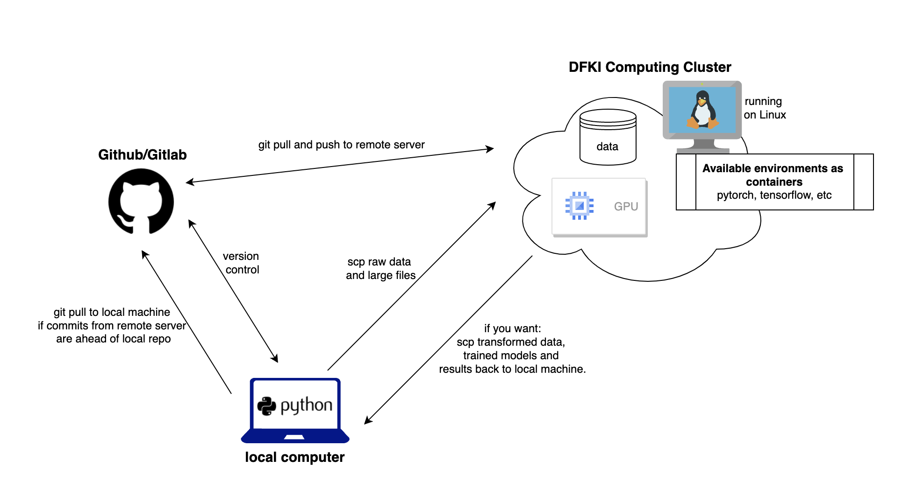
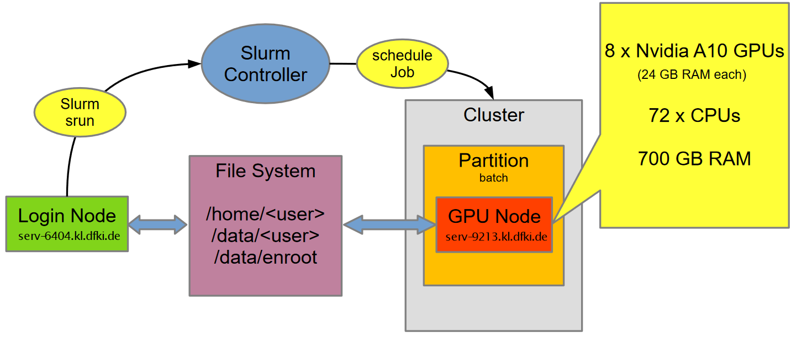
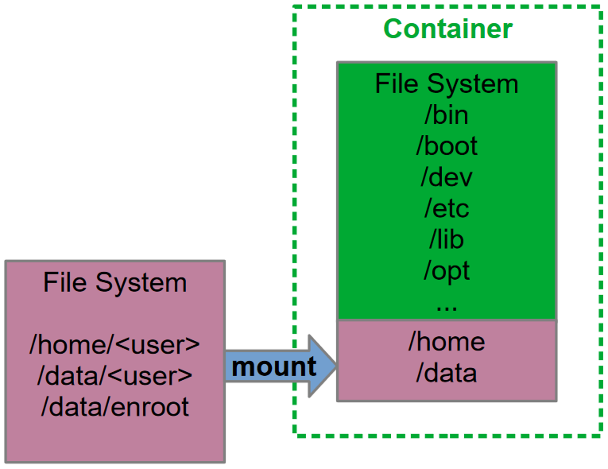
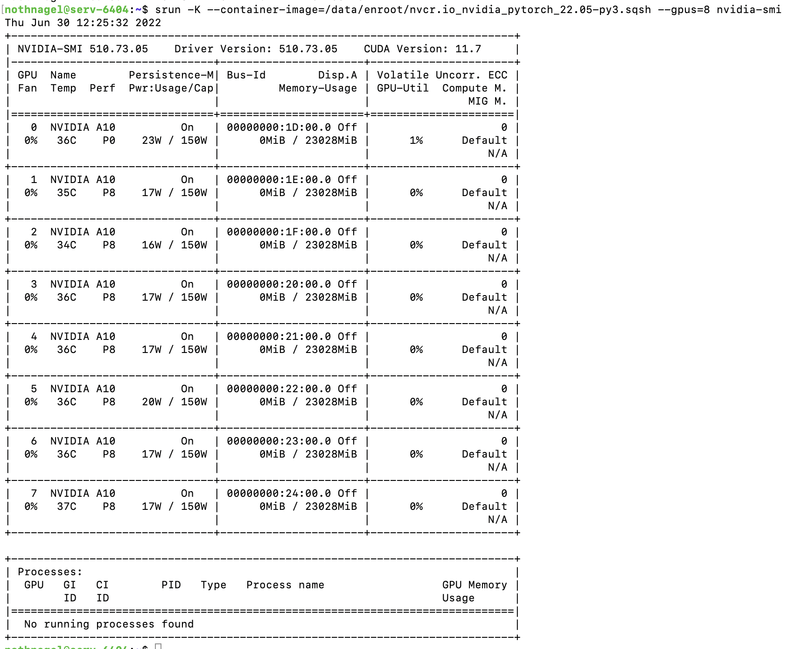
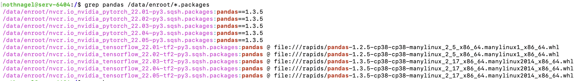
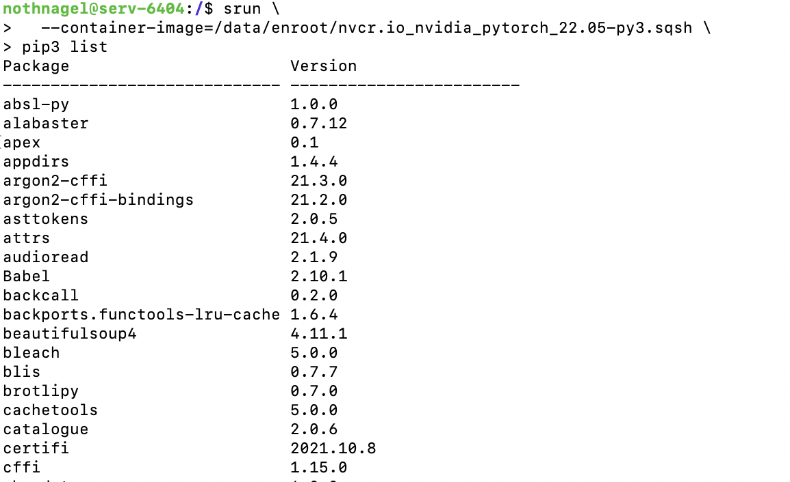
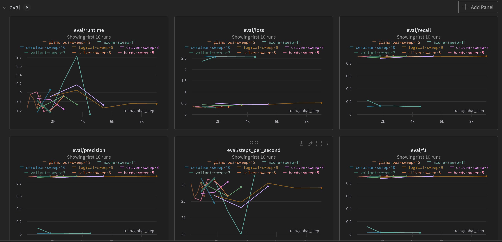
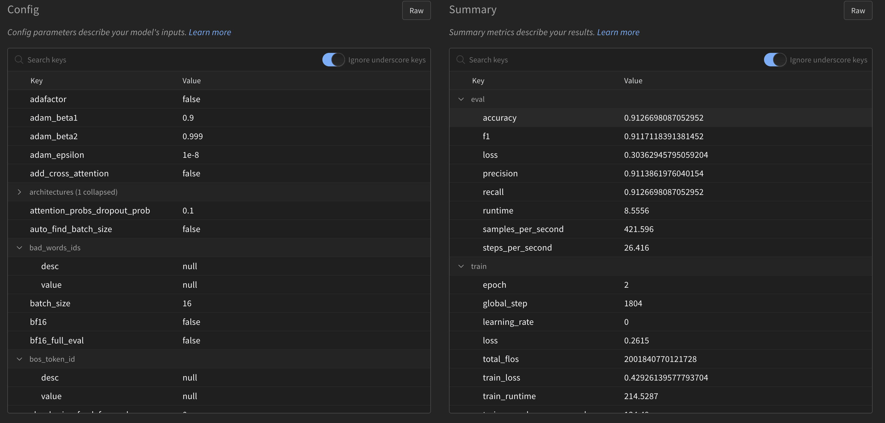
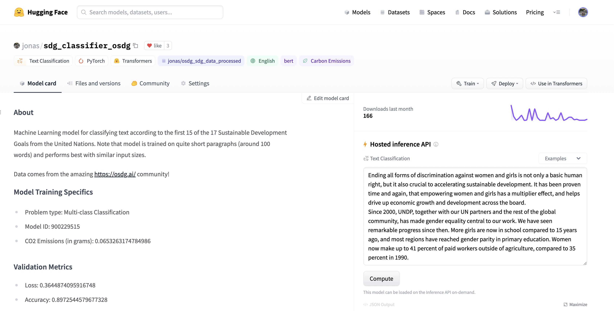

# Tutorial: How to Access the DFKI Computing Infrastructure

Members of the Mbaza Community have the great opportunity to access a high-performance computing (HPC) cluster at the [German Research Center for Artificial Intelligence](https://www.dfki.de/en/web).

## What is this all about?
Know the feeling when you want to train a machine learning model on your computer and training just doesn't finish? One solution is to use much more powerful hardware!

This tutorial describes how to access an HPC computing cluster at DFKI which also offers GPUs.

## Youtube Training with FAQ

[](https://youtu.be/Zsq5OUC5pMw "Training: How to Access and Use Computing Infrastructure at DFKI")


## Prerequisites

Before you get started with running your code and training models you need to sort out two things:

1. Create an account for the **DFKI computing cluster**.

2. Create an account for the **DFKI VPN** and set up the VPN connection following the [steps described here](media/DFKI%20VPN_overview.pdf).

    
    
*It is also a good idea to create a **GitHub** account if you do not already have one. We will need it to version control our code and projects.* 

Please note that the computing infrastructure is only available to Mbaza Community members. Community members can get in touch to receive instructions on how to create these accounts.

## Overview of components

Usually we will work with three components:

- GitHub/Gitlab for version control
- The remote server for storing large files and running jobs on GPUs.
- Our local machine (laptop) for code development and repo set-up.

Below you find an example visualisation how these components work with each other and interact. 



## Set up your development environments

Before jumping in the fun part - model training - we should take some time to properly set-up and connect the components mentioned above. The following steps are only one way to do it. Feel free to do it as it works best for you!

### Recommended Workflow

1. Create your repo with a consistent folder structure (e. g. using the [Cookiecutter structure](https://drivendata.github.io/cookiecutter-data-science/)) on your local machine.
2. Push this repo to GitHub/Gitlab.
    - IMPORTANT: Include large folders/files in the gitignore. We do not want to push our datasets (if they are large) and trained models to GitHub but keep them only on the remote server!
3. Connect to the remote server ([see below](#connect-to-the-remote-server)) and ```git clone``` the repo from GitHub/Gitlab on the server in the file directory of your choice: This will most likely be in ```/data/USERNAME/```.
4. If the dataset is not on GitHub (for instance if it is larger than 100MB), use ```scp``` to copy the large dataset files from your local machine to the remote server ([see below on how to](#sending-data-and-files-to-remote-server)). Put it, for example, under ```/data/USERNAME/PROJECT_FOLDER```. 
*Advanced: Create a new data, models folder in the cloned repo and ```scp``` the large files directly there. You MUST specify the gitignore accordingly then. Easier to just drop the data in a separate folder on the remote server and mount this folder when training.*

—> Now you have set up the base structure:
- You have a Repo pushed to GitHub for version control. **✓** 
- You have the data and repo on your local machine for code development. **✓** 
- You have the repo on the remote server to pull changes and run the code with the datasets and GPUs. **✓** 

 ### Workflow to stay in sync

1. Develop code in your IDE. 
2. Push new commits from local machine to GitHub. This is the usual workflow without interacting with a remote server for model training. 
3. Keep the repo on the remote server up-to-date by pulling changes from GitHub to remote server. 

*Note:* 
- If there are any large files that should not enter GitHub, ```scp``` them directly from local machine to remote server.
- If raw data has to be transformed and it needs GPU support (or you simply decide to run all jobs on the remote machine which is recommended), run it on the remote server and directly put it in a data folder there.

## Connect to the remote server

Now we can connect to the remote Server. Note that the server runs on Linux, so you should get familiar with simple Linux Terminal commands (see [here](https://linuxconfig.org/bash-scripting-tutorial-for-beginners) for an introduction).

1. Connect to the DFKI VPN.
2. Open terminal on your local machine and ```ssh``` into remote server using your Computing Cluster Credentials (username and password):
    
    ``` bash
    ssh USERNAME@serv-6404.kl.dfki.de
    ```
3. (Optional) Check available hardware resources and information about the cluster:

    | Description |Command|
    |---|---|
    | Check available disk space | ```df -h``` |
    | Check disk usage of current folder | ```du -sch``` |
    | Check disk usage of each sub-directory | ```du -hsx $(ls -A) \| sort -rh``` |
    | Infos about the computing cluster | ```sinfo``` or ```clusterinfo``` |

## Understand the cluster architecture
The figure below shows the most important parts of the DFKI computing cluster.



By [connecting to the cluster](#connect-to-the-remote-server), you have already made acquiantance with the **login node** (```serv-6404.kl.dfki.de```).

Next is the **file system** of the cluster. There are three important directories:
- The ```home``` directory is relatively small at 20 GB shared across all users. It is only meant for scripts and configuration files. *Do not store large files here*. Also, be careful since this is often the default install location for large packages such as Conda, so make sure to change the path during installation.
- The ```data``` directory is 7 TB large, again shared across users. It is intended for projects with data, checkpoints, logs, etc.
- the ```/data/enroot``` directory is where you store [Enroot](https://github.com/NVIDIA/enroot/blob/master/README.md) images.

To schedule and manage workloads/jobs, the cluster uses the **[Slurm Resource Manager](https://slurm.schedmd.com/)**. It allows you to submit jobs, which will then be run as soon as the required resources are available.

All Slurm jobs run in **[containers](https://www.ibm.com/cloud/learn/containerization)**. Containers are predefined, isolated runtime environments which are used for exactly one job and then discarded. They enable the parallel execution of multiple workloads on one GPU node without interference. Containers are created (instantiated) from images which are like blueprints specifying the kind of software packages that should be available in the container. This is powered by **[Enroot](https://github.com/NVIDIA/enroot/blob/master/README.md)**, an alternative to the well-known Docker. While containers are in principle isolated, it is possible to share directories from the main file system with the container by *mounting* them. This allows the workload inside the container (e. g. training a machine learning model) to access files such as training data sets from the main file system.



## Scheduling and running jobs
We will now look at some commands that allow you to run jobs on the cluster. Since Slurm is used as the resource manager, all command begin with an *s*.

### ```srun``` command
```srun``` is used to schedule a job. This is the syntax of the command:

``` bash
srun --container-mounts=/data:/data,$HOME:$HOME \
--container-workdir=$PWD \
--container-image=/data/enroot/my-enroot-image.sqsh \
--gpus=4 \
--mem=128GB \
--cpus-per-task=32 \
my-executable-to-run-in-container.sh
```

The arguments have the following meanings:

|Argument|Description|
|-|-|
|```--container-mounts```|Used to mount directories into the container. Format: ```<dir-on-host>:<dir-in-container>```. If you want to mount several directories, separate them with commas.|
|```--container-workdir```|Working directory in the container. The variable ```$PWD``` refers to the current directory.|
|```--container-image```|Path to the Enroot image from which to create the container.|
|```--gpus```|Number of GPUs to request for the job (default when not specified is 0).|
|```--mem```|Size of CPU memory to request for the job (default: 16 GB).|
|```--cpus-per-task```|Number of CPUs to request for the job per task (default: 2). The number of tasks is always 1.|

Finally, ```my-executable-to-run-in-container.sh``` is the executable you would like to run on the cluster.

#### ```usrun.sh```
To make it a bit easier to schedule jobs, a convenience script is provided at ```/home/steffen/bin/usrun.sh```. Copy this file to your ```/bin``` directory and add it to your ```$PATH``` in ```~/.bashrc```.

Then, you can use this to run jobs. Here is an example to check if GPUs are running (using the ```nvidia-smi``` command):
    
``` bash
usrun.sh --gpus=8 nvidia-smi
```
    
You should see this:



### Job queue (```squeue```)
To check which jobs are currently running or next in line:

| Description |Command|
|---|---|
| Check queued jobs | ```squeue``` |
| Check your own queued jobs | ```squeue -u <your-user-name>``` |
| Get table of queued jobs (note that the ```-O``` argument is used for formatting options) | ```squeue -t R -O JobID:8,UserName:12,tres:60``` |

In the table of queued jobs, ```R``` stands for running and ```PD``` for pending.

### Interactive sessions
You can also run interactive sessions.

    usrun.sh --gpus=1 --pty bash

Use the ```--time``` argument to make sure the job automatically ends after ```x``` minutes, otherwise you will block resources for everybody else trying to access the cluster:

    usrun.sh --gpus=1 --time=60 --pty bash

### Kill jobs
To stop running robs, execute
    
    scancel <job-id>
    
or press ```ctrl-c``` twice in the output console.

### See outputs of a job
To see the outputs of a running job, use the ```sattach``` command, where you specify the job ID whose output you would like to see.

``` bash
usrun.sh --time=10 ./demos/output-demo.sh
squeue
sattach <jobid>.0
```

### Attach and detach, screen
Imagine you want to use the console for something else, but a job with an output is still running. The solution is to use a [screen](https://linuxize.com/post/how-to-use-linux-screen/) to detach from the running output, and to reattach later.

| Description | Command |
|---|---|
| Create screen | ```screen``` |
| Detach running screen | ```Ctrl-a Ctrl-d``` |
| Show existing screens | ```screen -ls``` |
| Attach to running screen | ```screen -r``` |

## Set up your execution environment
For Machine Learning workloads, you will need a set of packages such as Pandas, PyTorch, TensorFlow or scikit-learn. Depending on what you need, you have to take different steps to set up your execution environment:
- Ideally, there is already an image available with all packages you need: [Use a ready-made image](#use-a-ready-made-image)
- If you use a Conda ```environment.yml``` file: [See here](#using-conda-environmentyml)
- If you use a pip ```requirements.txt```: [See here](#install-packages-into-the-container-with-pip-requirementstxt)
- If you want to use a Docker image available online: [Use an image from Docker Hub or Nvidia](#use-images-from-docker-hub-or-nvidia)

### Use a ready-made image
To see what pre-installed images contain packages we need, we can use ```grep```. For example, to see all containers that have ```pandas``` pre-installed you can run:

``` bash
grep pandas /data/enroot/*.packages
```



For training a machine learning model, you may for example use the PyTorch image ```nvcr.io_nvidia_pytorch_22.05-py3.sqsh```. To display all the pre-installed python packages within this container:

```
srun \
  --container-image=/data/enroot/nvcr.io_nvidia_pytorch_22.05-py3.sqsh \
pip3 list
```

This is the output:



This is only the first few lines, we can see that there are a lot of preinstalled python packages. In the ideal case all your requirements and dependencies are already installed and you can simply choose a ready-made image.

### Using Conda ```environment.yml```

#### Solution 1: Install environment locally and make it available in container

Miniconda: see https://docs.conda.io/en/latest/miniconda.html#linux-installers

``` bash
wget https://repo.anaconda.com/miniconda/Miniconda3-py39_4.12.0-Linux-x86_64.sh
chmod a+x *.sh
./Miniconda3-py39_4.12.0-Linux-x86_64.sh
```

IMPORTANT: Set the installation location to ```/data/USERNAME/miniconda```. By default, conda will install to your ```/home/USERNAME/``` folder, which is not meant for large installations since it is too small.

Create and test Conda environment:

``` bash
conda env create -f /home/steffen/demos/environment.yml
conda activate demo
python -u -c "import torch; print(f'PyTorch {torch.__version__}')"
# prints PyTorch 1.12
```

Activate Conda environment in container:

Can be run on images without any Conda installation,
e.g. use image ```/data/enroot/nvcr.io+nvidia+cuda+11.6.2-cudnn8-runtime-ubuntu20.04.sqsh``` 
```usrun.sh ./demos/local-conda-env-demo.sh```

``` bash
#!/bin/sh
# activate local Conda environment
. /data/steffen/miniconda/etc/profile.d/conda.sh
conda activate demo
python -u -c "import torch; print(f'PyTorch {torch.__version__}')"
# prints PyTorch 1.12
```

#### Solution 2: Install Conda in container and create environment
For example use image ```/data/enroot/nvcr.io+nvidia+cuda+11.6.2-cudnn8-runtime-ubuntu20.04.sqsh``` --> ```usrun.sh ./demos/local-conda-env-demo.sh```

``` bash
#!/bin/bash
apt update
apt install -y wget
cd /usr/local
wget https://repo.anaconda.com/miniconda/Miniconda3-py38_4.12.0-Linux-x86_64.sh
chmod a+x Miniconda3-py38_4.12.0-Linux-x86_64.sh
./Miniconda3-py38_4.12.0-Linux-x86_64.sh -b -p /usr/local/miniconda
. /usr/local/miniconda/etc/profile.d/conda.sh
conda env create -f /home/steffen/demos/environment.yml
conda activate demo
python -u -c "import torch; print(f'PyTorch {torch.__version__}')"
```

### Install packages into the container with ```pip requirements.txt```
In this case, install Python and pip in the container and create environment.

For example, use image ```/data/enroot/nvcr.io+nvidia+cuda+11.6.2-cudnn8-runtime-ubuntu20.04.sqsh``` --> ```usrun.sh ./demos/container-install-demo-pip.sh```.

``` bash
#!/bin/bash
apt update
apt install -y python3 python3-pip
pip install -r /home/steffen/demos/requirements.txt
python3 -u -c "import torch; print(f'PyTorch {torch.__version__}')"
```

**Recommendation**: Try to find an image that contains your main ML framework and only install missing libraries at startup.

### Use images from Docker Hub or Nvidia
Docker images can be imported from Docker Hub (https://hub.docker.com/) or Nvidia (https://ngc.nvidia.com/catalog/containers).

#### Example: Import Alpine image to Enroot from *Docker Hub*
Original Docker command (DON'T RUN THIS):
``` bash
docker pull alpine:latest
```

Enroot import command:
``` bash
enroot import docker://alpine:latest
```

#### Example: Import Cuda image from *Nvidia Catalog*
Original Docker command (DON'T RUN THIS):
    
    docker pull nvcr.io/nvidia/cuda:11.2.1-base-ubuntu20.04

Enroot import command (replace the first ```/``` in the URL of the Docker command with ```#```):

    enroot import docker://nvcr.io#nvidia/cuda:11.2.1-base-ubuntu20.04

**Attention 1!** This creates large files in the cache (```$HOME/.cache/enroot```). Clean up afterwards!

**Attention 2!** Using Nvidia requires an Nvidia account and an API key!
API key can be generated here:
https://ngc.nvidia.com/setup/api-key.
To configure Enroot for using your API key, create
```enroot/.credentials``` within your ```$HOME``` and
append the following line to it:

    machine nvcr.io login $oauthtoken password <API_KEY>

### Save the new image from Container
Once you the image in the container is ready and you have made all changes you wanted, you can save the image permanently to be able to reuse it later:

``` bash
usrun.sh --container-save=/data/steffen/my-image.sqsh --pty bash
```

## Sending data and files to remote server
Another important requirement for running Machine Learning workloads is to have the training and test data readily available on the server. 

We want to store our large raw and processed datasets as well as trained models only on the remote server (remember, that is why we need to specify the gitignore). But first we need to send it the remote server. For this we use [```scp```](https://www.ionos.com/digitalguide/server/configuration/linux-scp-command/).

We want to use our assigned data folders which can be found under:

``` bash
cd data/USERNAME
```

then we may create a sub-folder for datasets such as

``` bash
mkdir test_data_folder
```
(use ```rmdir``` or ```rm -rf``` for removal)

Then to transfer data from your local machine you must open the *terminal* on your local machine, We may simply use ```scp``` to send secure copies to the servers. The command is the following:

``` bash
scp -r local_file_path ssh destination
```

the destination is the DFKI server and the file path you want to specify, for example using the folder created above it would be:

``` bash
ssh USERNAME@serv-6404.kl.dfki.de:/data/USERNAME/test_data_folder/
```

and the full command would be

``` bash
scp -r local_file_path ssh USERNAME@serv-6404.kl.dfki.de:/data/USERNAME/test_data_folder/
```


## Working example
Let's start the real task: Running our code on the remote server and utilising the GPUs. Let’s use this repo as an example:

[https://GitHub.com/jonas-nothnagel/sdg_text_classification](https://GitHub.com/jonas-nothnagel/sdg_text_classification) 

*Note: If you run into permission errors, you may have to to make your bash scripts executable first. Simply run:*

```bash
chmod u+x your_sript.sh
```

Let’s run the minimal working example with support of 8 GPUs:

```bash
srun -K -N1 --gpus=8 --cpus-per-task=4 -p batch  \
--container-workdir=`pwd`  \
--container-mounts=/data/nothnagel/sdg_text_classification:/data/nothnagel/sdg_text_classification  \
--container-image=/data/enroot/nvcr.io_nvidia_pytorch_22.05-py3.sqsh  \
python ./src/test.py
```

Nice. It all works out!

## Fine-tune the transformer model

Now, let’s do what we came for and train our multi-class classification model! We have three components: 

- the [train.py](https://github.com/jonas-nothnagel/sdg_text_classification/blob/main/src/train_hyperparameter_tuning.py) function.
- the [bash script](https://github.com/jonas-nothnagel/sdg_text_classification/blob/main/job.sh) that installs all the requirements and starts the training script.
- the [bash script](https://github.com/jonas-nothnagel/sdg_text_classification/blob/main/run-job.sh) that contains the specification for the remote server and runs the job: What container,  how much RAM/GPUs/etc shall be used

For our experiments we will use [Wandb](https://wandb.ai/site) for tracking the experiments and subsequently run sweeps for hyper-parameter tuning. Using a tool such as Wandb is optional but highly recommended. It is good practice to get used to use such DevOps tool while building, training and testing models. 

***Add login tokens and credentials:***

- If you want to run the python scripts above without modification, you therefore need to create a Wandb account and provide your login credentials as indicated in the script. Otherwise, comment out the respective lines in the script.
- The same is true if you want to directly push your trained model to the [huggingface hub](https://huggingface.co/).

Store your login-tokens as *txt files* to read them in directly and do not push them by adding the folder in which they are nested to the *[gitignore](https://github.com/jonas-nothnagel/sdg_text_classification/blob/main/.gitignore)*. 

### Train the models

To train the multi-class classification model we cd in the cloned repo and run:

```bash
bash run-job.sh 
```

This will invoke the three components mentioned above and:

- train the model
- log all training details to Wandb and
- automatically pushes the best model on your huggingface hub

(if you provided your Login credentials in the [train.py](http://train.py) script). 

### Hyperparametertuning

In the [train.py](http://train.py) script you may notice that training parameters are given. Tuning this parameters and finding the optimal values for the problem at place is a common way to increase model performance. This is called hyperparameter-tuning. Basically we re-run the experiment with different combination of parameter values and log the results. Subsequently, we can find the best performing combination and re-train the model one last time with these optimal configuration and push it to the hub.

For hyperparmater-tuning we are using [wandb](https://docs.wandb.ai/guides/sweeps) again. To run hyperparameter tuning you can use the bash script as follows:

```bash
bash run-job-hyper.sh
```

If it ran successfully you will have a great overview of the training such as:



And obtain the best parameters:



As you can see we further improved our **f1-score** to over **91%**! Great!

And the model is pushed to the hub and ready for inference!

[https://huggingface.co/jonas/roberta-base-finetuned-sdg](https://huggingface.co/jonas/sdg_classifier_osdg)


