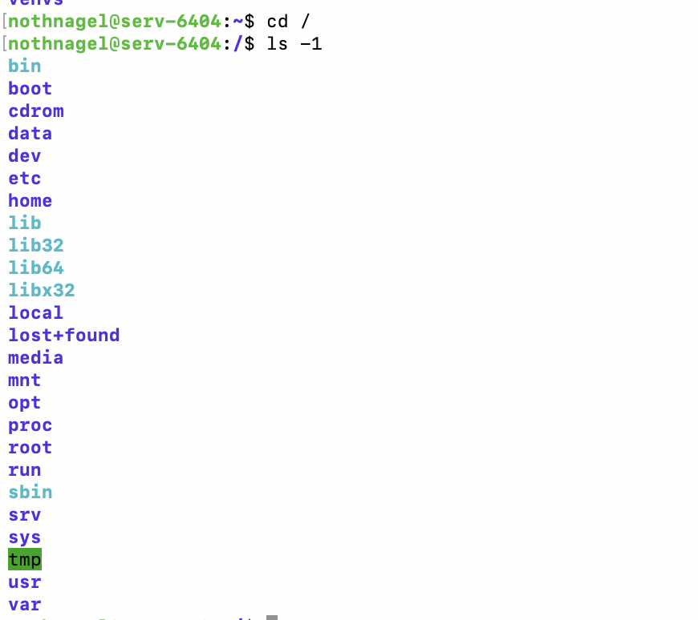

# Tutorial: How to Access the DFKI Computing Infrastructure

Before you get started with running your code and training models you need to sort out two things:

1. Set-up and connect to the **DFKI VPN**. Create your account following this guideline:
    
    [DFKI VPN_overview.pdf](https://github.com/MBAZA-NLP/hpc-infrastructure-access/blob/main/media/DFKI%20VPN_overview.pdf)
    
    
    
2. Create your computing cluster account following this guideline:
    
    [DFKI Compute Cluster Access.pdf](https://github.com/MBAZA-NLP/hpc-infrastructure-access/blob/main/media/DFKI%20Compute%20Cluster%20Access.pdf)
    

After this you should have following credentials:

- DFKI Credentials for VPN (*username & password).*
- DFKI Computing Cluster Credentials (*username & password).*

*It is a good idea to create a **Github** account as well if you do not already have one. We will need it to version control our code and projects.* 

# Connect to the remote server

Now we can connect to the remote Server. Note that the server runs on Linux, so you should get familiar with simple Linux Terminal commands.

1. Connect to VPN as shown above.
2. Open terminal on your local machine and *ssh* into remote server using your Computing Cluster Credentials (username and password):
    
    *ssh USERNAME[@serv-6404.kl.dfki.de](mailto:nothnagel@serv-6404.kl.dfki.de)*
    
3. Optional: Check if GPUs are running:
    
    *srun -K --container-image=/data/enroot/nvcr.io_nvidia_pytorch_22.05-py3.sqsh --gpus=8 nvidia-smi*
    

You should see this:


# Overview of components

Usually we will work with three components:

- Github/Gitlab for version control
- The remote server for storing large files and running jobs on GPUs.
- Our local machine (laptop) for code development and repo set-up.

Below you find an example visualisation how these components work with each other and interact. 


# Set-up your development environments:

Before jumping in the fun part - model training - we should take some time to properly set-up and connect the components mentioned above. The following steps are only one way to do it. Feel free to do it as it works best for you!

**Example Workflow:**

1. Create your repo with a consistent folder structure on your local machine.
2. Push this repo to Github/Gitlab. IMPORTANT: Include large folders/files in the gitignore. We do not want to push our datasets (if they are large) and trained models to github but keep them only on the remote server!
3. *ssh* into the remote server and *git clone* the repo from Github/Gitlab on the server in the file directory of your choice: This will most likely be in /data/USERNAME/
4. If the dataset is not on github (for instance if it is larger than 100MB), *scp* the large files (raw data mostly) from your local machine to the remote server. Put it, for example, under /data/USERNAME/PROJECT_FOLDER. 
*Advanced: Create a new data, models folder in the cloned repo and scp the large files directly there. You MUST specify the gitignore accordingly then. Easier to just drop the data in a separate folder on the remote server and mount this folder when training.*

—> Now you have set up the base structure. 
You have a Repo pushed to Github for version control. **✓** 
You have the data and repo on your local machine for code development. **✓** 
You have the repo on the remote server to pull changes and run the code with the datasets and GPUs. **✓** 

 **Workflow to stay in sync:**

1. Develop code in your IDE. 
2. Push new commits from local machine to Github. This is the usual workflow without interacting with a remote server for model training. 
3. Keep the repo on the remote server up-to-date by pulling changes from Github to remote server. 

*Note:* 

- If there are any large files that should not enter Github. *scp* them directly from local machine to remote server.
- If raw data has to be transformed and it needs GPU support (or you simply decide to run all jobs on the remote machine which is recommended), run it on the remote server and directly put it in a data folder there.

# Sending data and files to remote server

We want to store our large raw and processed datasets as well as trained models only on the remote server (remember, that is why we need to specify the gitignore). But first we need to send it the remote server. For this we use *scp.*

We want to use our assigned data folders which can be found under:

*cd data/USERNAME* 

then we may create a sub-folder for datasets such as

*mkdir test_data_folder (rmdir* or *rm -rf* for removal)

Then to transfer data from your local machine you must open the *terminal* on your local machine, We may simply use *scp* to send secure copies to the servers. The command is the following:

*scp -r local_file_path ssh destination* 

the destination is the DFKI server and the file path you want to specify, for example using the folder created above it would be:

*ssh* [nothnagel@serv-6404.kl.dfki.de](mailto:nothnagel@serv-6404.kl.dfki.de)*:/data/USERNAME/test_data_folder/*

and the full command would be 
*scp -r local_file_path ssh USERNAME[@serv-6404.kl.dfki.de](mailto:nothnagel@serv-6404.kl.dfki.de):/data/USERNAME/test_data_folder/*

# Understand the remote server structure

Once you are connected you can take a look at the folder structure:

*ls -1*



To see what pre-installed images contain packages we need we can *grep* them. For example to see all containers that have *pandas* pre-installed you can run:

*grep pandas /data/enroot/*.packages*


Now it is important to understand how the interaction between the images, your job and virtual environments. Generally we want to first choose a container and mount it. Whatever we do next is done within this container. 
This is important since we need to work inside these containers to ensure proper set-up and utilisation of the Nvidia’s GPUs. 
The default command to mount the latest pytorch image and if you created a costumized data folder *test_folder* to store your datasets would be:

Here we run a slurm *srun*  command to mount and display all the pre-installed python packages within this container: 

```
srun \
  --container-image=/data/enroot/nvcr.io_nvidia_pytorch_22.05-py3.sqsh \
pip3 list
```


This is only the first few lines, we can see that there are a lot of preinstalled python packages. In the ideal case all your requirements and dependencies are already installed. Otherwise we will need to install additional dependancies for example with *pip install -r requirements.txt.* But this will be covered later.

# Running your code

Now we can do what we came for: Running our code on the remote server and utilising the GPUs. Let’s use this repo as an example:

[https://github.com/jonas-nothnagel/sdg_text_classification](https://github.com/jonas-nothnagel/sdg_text_classification) 

As explained above, connect to the remote server and *git clone* the repo into /data/USERNAME/

First, let’s simply compile a python script without GPU support.  Again, mount the container of your choice, but also specify where the Repository lies on the remote server. Since this is the place where we pushed all the code beforehand: here for example “sdg_text_classification”.

We choose the newest pytorch container:

```bash
srun \
  --container-image=/data/enroot/nvcr.io_nvidia_pytorch_22.05-py3.sqsh \
  --container-workdir="`pwd`" \
  --container-mounts=/data/nothnagel/sdg_text_classification:/data/nothnagel/sdg_text_classification \
  python ./src/test.py
```

Bashing

Now it is good practice to not copy paste these code lines into the terminal directly but to write a **[bash script](https://github.com/jonas-nothnagel/sdg_text_classification/blob/main/run_example.sh)** and compile it with

*bash run_example.sh*

```bash
#!/bin/bash
srun \
  --container-image=/data/enroot/nvcr.io_nvidia_pytorch_22.05-py3.sqsh \
  --container-workdir="`pwd`" \
  --container-mounts=/data/nothnagel/sdg_text_classification:/data/nothnagel/sdg_text_classification \
  python ./src/test.py
```

We want to do this because in the bash script we can specify the whole job, including:

- Creating/activating a virtual environment if necessary
- installing additional dependencies
- specifying the GPU support
- specifying experiment tracking and where to put results etc.

# Next step:

Let’s run the minimal working example with support of 8 GPUs:

```bash
srun -K -N1 --gpus=8 --cpus-per-task=4 -p batch  \
--container-workdir=`pwd`  \
--container-mounts=/data/nothnagel/sdg_text_classification:/data/nothnagel/sdg_text_classification  \
--container-image=/data/enroot/nvcr.io_nvidia_pytorch_22.05-py3.sqsh  \
python ./src/test.py
```

Let’s train our model using the train function and installing dependencies directly from the python script:

ERROR: The GPUs have to be specified correctly still. This runs into an error for GPU setup.  consult: [http://projects.dfki.uni-kl.de/km-publications/web/ML/core/hpc-doc/docs/slurm-cluster/resource-allocation/](http://projects.dfki.uni-kl.de/km-publications/web/ML/core/hpc-doc/docs/slurm-cluster/resource-allocation/)

```bash
#!/bin/bash
srun -K --gpus=8 -p batch  \
--container-workdir=`pwd`  \
--container-mounts=/data/nothnagel/sdg_text_classification:/data/nothnagel/sdg_text_classification  \
--container-image=/data/enroot/nvcr.io_nvidia_pytorch_22.05-py3.sqsh  \
python ./src/train.py
```